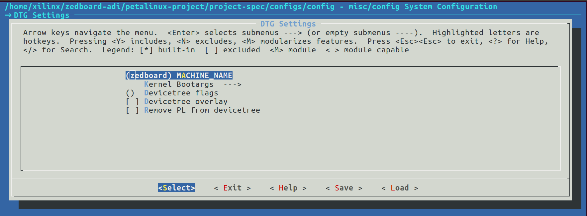
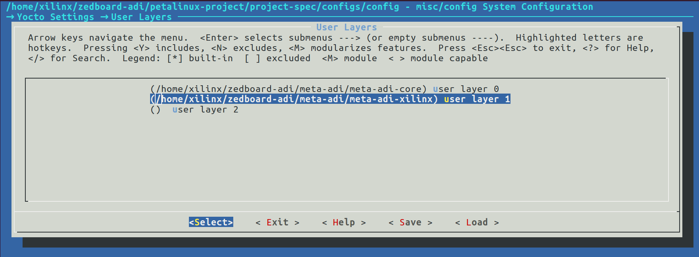
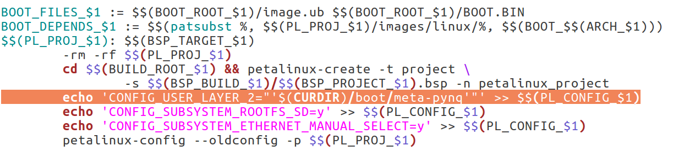
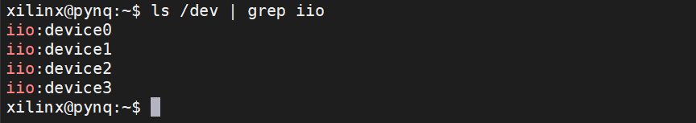
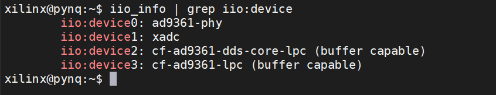

# ZedBoard PYNQ + AD9361

Instructions on how to build PYNQ on zedboard with ADI linux kernel.

* Building environment
  * Ubuntu 16.04
  * PetaLinux 2018.3
  * Vivado 2018.3
* Testing boards
  * V3 FMC9361_V1.0

## 1. Build HDL

Refer to [ADI's official repository](https://github.com/analogdevicesinc/hdl) to build a hardware project. You may switch to proper branches to match the petalinux and vivado version. Refer to [meta-adi](https://github.com/analogdevicesinc/meta-adi/tree/master/meta-adi-xilinx) for more information on different versions.

## 2. Create PetaLinux BSP

* Create a petalinux project

  ```bash
  petalinux-create -t project --template zynq --name zedboard-adi
  ```

* Clone meta-adi and checkout at branch `2019_R1`

  ```bash
  git clone https://github.com/analogdevicesinc/meta-adi.git
  cd meta-adi && git checkout 2019_R1 && cd ..
  ```

* Config project using the hardware descriptions (.hdf or .xsa files) exported from vivado

  ```bash
  cd zedboard-adi
  petalinux-config --get-hw-description <path_to_hdf>
  ```

  When running petalinux-config, a configuration menu will come up.

  Go to DTG Settings, change MACHINE NAME to zedboard

  

  Go to Yocto Settings -> User Layers, add meta-adi-core and meta-adi-xilinx layers by typing the absolute path of those two folders.

  

  Save and exit.

* Export petalinux bsp

  ```bash
  petalinux-package --bsp --project ./ --output ZedBoard-ADI.bsp
  ```

## 3. Build PYNQ

* Clone PYNQ and checkout at branch image_v2.4

  ```bash
  git clone https://github.com/Xilinx/PYNQ.git
  cd PYNQ && git checkout image_v2.4 && cd ..
  ```

* Edit `PYNQ/sdbuild/Makefile`.

  

  In line 127, change `CONFIG_USER_LAYER_0` to `CONFIG_USER_LAYER_2`. (We edit this because by default it will add the meta-pynq layer to user layer 0, which will overwrite the meta-adi-core layer we added before.)

* Prepare board folder

  Create a new folder under PYNQ/boards with name ZedBoard-ADI. Copy bitstream and bsp file (exported from petalinux) into the new-created folder. Create a new file with name ZedBoard-ADI.spec, and add the following content

  ```
  ARCH_ZedBoard-ADI := arm
  BSP_ZedBoard-ADI := ZedBoard-ADI.bsp
  BITSTREAM_ZedBoard-ADI := system_top.bit
  STAGE4_PACKAGES_ZedBoard-ADI := pynq ethernet jupyter
  ```
  
  make sure the name of bsp and bitstream is correct.

* Prepare prebuilt image

  Download pynq v2.4 prebuilt image from [Xilinx office website](https://www.xilinx.com/member/forms/download/xef.html?filename=pynq_rootfs_arm_v2.4.zip)

* Run make

  ```bash
  cd PYNQ/sdbuild
  make BOARDS=ZedBoard-ADI PREBUILT=<path_to_prebuilt_image>
  ```

  After the compilation is finished, The SD card image is located in PYNQ/sdbuild/output/

## 4. Python bonding for libiio

Install AD9361 to the board and boot, you should see four iio devices under /dev (one for xadc, three for ad3961)



Now we can install some libraries to drive the ad9361

* Install dependencies

  ```bash
  sudo apt update
  sudo apt install build-essential \
      libxml2-dev bison flex libcdk5-dev cmake \
      libaio-dev libusb-1.0-0-dev \
      libserialport-dev libavahi-client-dev \
      doxygen graphviz \
  ```

* Install libiio and pylibiio

  ```bash
  git clone https://github.com/analogdevicesinc/libiio.git
  cd libiio
  cmake ./
  make all
  sudo make install
  sudo ldconfig
  cd bindings/python/
  sudo python3 setup.py.cmakein install
  cd ~
  ```

  Now you can use `iio_info` to get the information of iio devices.

  

  Refer to [pyadi-iio documents](https://analogdevicesinc.github.io/pyadi-iio) to interact with AD9361 through python

